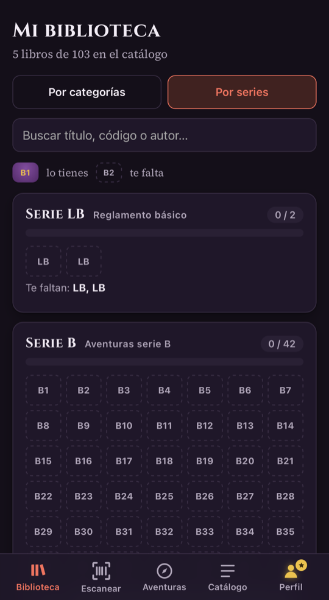
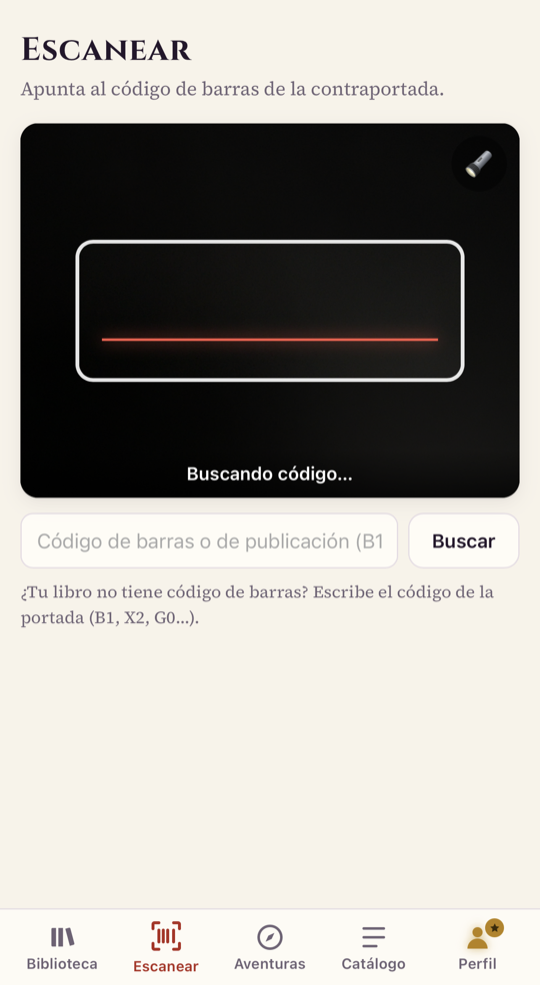
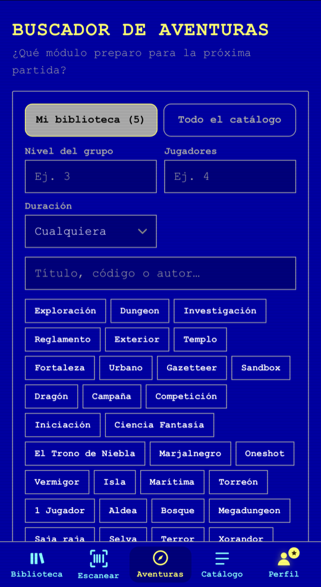
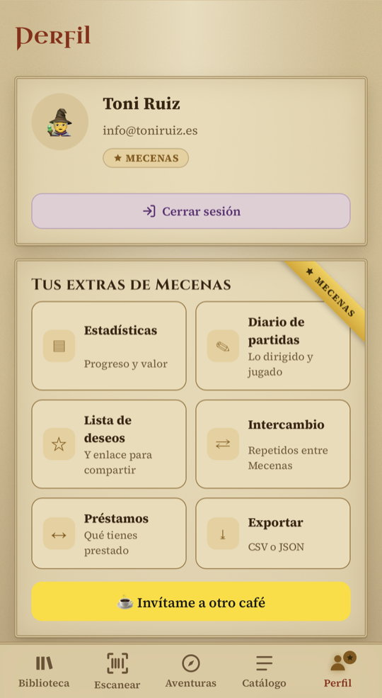
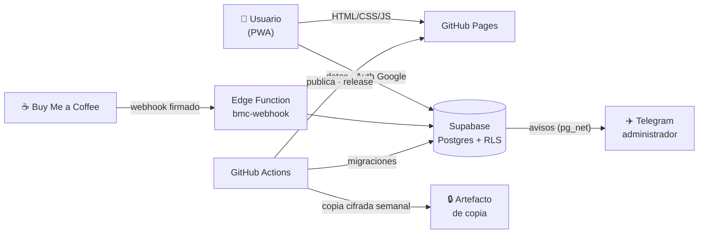

<div align="center">


# Escriba de la Marca

**La biblioteca de bolsillo para coleccionistas de *Aventuras en la Marca del Este*.**<br>
Escanea tus módulos, descubre qué te falta de cada serie y encuentra la aventura perfecta para tu próxima partida.

[](https://github.com/Favashi/escribadelamarca/releases)
[](https://github.com/Favashi/escribadelamarca/actions/workflows/pages.yml)
[](LICENSE)
[](https://github.com/Favashi/escribadelamarca/commits/main)
<br>
[](#-empezar-a-usarla)
[](https://supabase.com)
[](#%EF%B8%8F-tecnología)
[](#-qué-es)
[](https://buymeacoffee.com/toniruiz)

### [🔗 Abrir la app](https://favashi.github.io/escribadelamarca/) · [📰 Novedades](https://github.com/Favashi/escribadelamarca/releases) · [🐞 Informar de un problema](https://github.com/Favashi/escribadelamarca/issues)

</div>

---

## Índice

- [¿Qué es?](#-qué-es) · capturas
- [Funcionalidades](#-funcionalidades)
- [Empezar a usarla](#-empezar-a-usarla)
- [Mecenas](#-mecenas)
- [De dónde salen los datos](#%EF%B8%8F-de-dónde-salen-los-datos)
- [Tecnología](#%EF%B8%8F-tecnología)
- [Arquitectura](#-arquitectura)
- [Desarrollo](#-desarrollo)
- [Hoja de ruta](#%EF%B8%8F-hoja-de-ruta)
- [Contribuir](#-contribuir)
- [Privacidad y seguridad](#-privacidad-y-seguridad)
- [Licencia y avisos](#%EF%B8%8F-licencia-y-avisos)
- [Agradecimientos](#-agradecimientos)

---

## 📜 ¿Qué es?

¿Estás en una tienda o en unas jornadas, con un módulo en la mano, y no recuerdas si ya lo tienes?
**Escriba de la Marca** responde en un segundo: apunta la cámara al código de barras y te dice si está en tu
colección y desde cuándo. Además te enseña los huecos de cada serie y te ayuda a elegir aventura según el nivel de
tu grupo.

Es una **app web gratuita, instalable en el móvil**, hecha por un aficionado para la comunidad de la Marca del Este.

<table>
  <tr>
    <td align="center"></td>
    <td align="center"></td>
    <td align="center"></td>
    <td align="center"></td>
  </tr>
  <tr>
    <td align="center"><sub><b>Tu colección por series</b><br>tema oscuro</sub></td>
    <td align="center"><sub><b>Escáner</b><br>tema claro</sub></td>
    <td align="center"><sub><b>Buscador de aventuras</b><br>tema Retro EGA</sub></td>
    <td align="center"><sub><b>Extras de Mecenas</b><br>tema Pergamino</sub></td>
  </tr>
</table>

## ✨ Funcionalidades

| | |
|---|---|
| 📚 **Tu colección, ordenada** | Casi 100 publicaciones, con sus portadas, por categorías o **por series** (B, X, C, G…), con los huecos a la vista: «te faltan B7, B13…». |
| 📷 **Escáner de códigos de barras** | Escaneo continuo con la cámara (Android e iPhone). Te dice si ya tienes el libro; si no, lo añades con un toque. Los módulos antiguos se buscan por el código de portada (B1, X2…). |
| 🎲 **Buscador de aventuras** | Filtra por nivel del grupo, número de jugadores, duración y tipo (mazmorra, exploración, investigación…), en tu biblioteca o en todo el catálogo. |
| 🏆 **Logros y rangos** | Celebra cuando completas una serie o llegas a 10, 25 o 50 libros. Sube de *Aprendiz de escriba* a *Gran Escriba de la Marca* ayudando a mejorar el catálogo. |
| ☆ **Lista de deseos** | Apunta los módulos que te faltan y compártela con un enlace: tu grupo sabrá qué regalarte. |
| 🆕 **Series que crecen** | Las novedades se marcan como «Nuevo» y la app te avisa de los módulos recién publicados en las series que coleccionas. |
| 🤝 **Catálogo de la comunidad** | Propón libros o códigos que falten y sugiere correcciones desde cada ficha; se revisan antes de publicarse. |
| ☁️ **En todos tus dispositivos** | Entras con Google y tu biblioteca se sincroniza entre el móvil y el ordenador. |
| 🎨 **Temas** | Automático, claro y oscuro, más *Pergamino* y *Retro EGA* para Mecenas. |
| 🔐 **Tus datos, tuyos** | Descarga todo en JSON cuando quieras, o elimina la cuenta y todos sus datos desde el perfil. |

## 🚀 Empezar a usarla

1. Abre **<https://favashi.github.io/escribadelamarca/>** y entra con tu cuenta de Google.
2. **Instálala en el móvil** para usarla como una app más:
   - **iPhone (Safari):** botón Compartir → *Añadir a pantalla de inicio*.
   - **Android (Chrome):** menú ⋮ → *Instalar aplicación*.
3. Escanea tus primeros libros desde la pestaña **Escanear**. La bienvenida te guía en tres pasos.

> [!TIP]
> La app te avisa cuando hay una versión nueva. También puedes comprobarlo en **Perfil → Acerca de → Buscar actualizaciones**.

## ⭐ Mecenas

La app es y seguirá siendo **gratuita**. Si te resulta útil, puedes [invitarme a un café](https://buymeacoffee.com/toniruiz):
con **un café (5 €, pago único)** te haces **Mecenas para siempre** y desbloqueas, como agradecimiento:

- ✎ **Diario de partidas**: qué módulos has dirigido o jugado, cuándo y con qué grupo.
- ⇄ **Repetidos e intercambio** con otros Mecenas (voluntario).
- ↔ **Registro de préstamos**.
- ▤ **Estadísticas** y valor de tu colección.
- ⤓ **Exportación a CSV** y los temas **Pergamino** y **Retro EGA**.

Las aportaciones ayudan a pagar el servidor y el tiempo dedicado a mejorar la app.

## 🗂️ De dónde salen los datos

El catálogo inicial se construyó a partir de fuentes públicas y desde entonces se mantiene en la propia app, con la ayuda de la comunidad:

| Fuente | Qué aporta |
|---|---|
| [Distribuciones Sombra](https://dbsombra.com/index.asp?cod=12LM) | Título, autor, formato, páginas, códigos de barras, precio y fecha de catálogo. |
| [Codex LMDE](https://github.com/diacritica/codexlmde) | Códigos históricos (B19, C4, H1…) y datos de juego: niveles, personajes, sesiones, etiquetas y resúmenes. |
| [Tesoros de la Marca](https://tesorosdelamarca.com/) | Referencias (SKU) de tienda. |
| **La comunidad** | Novedades, códigos verificados escaneando ejemplares reales y correcciones validadas. |

Las **portadas** son © de sus autores y se usan con permiso de La Marca del Este. No están en este repositorio: se guardan aparte (Supabase Storage) y no se incluyen en la licencia AGPL del código.

¿Ves un dato mal? Abre el libro en la app y pulsa **«✎ Sugerir cambios»**.

## 🛠️ Tecnología

| Capa | Tecnología |
|---|---|
| Web | HTML, CSS y JavaScript (módulos ES) **sin paso de compilación**; PWA con *service worker* |
| Backend | [Supabase](https://supabase.com): Postgres con **RLS** en todas las tablas, Auth con Google, Edge Functions y Vault |
| Escáner | [`BarcodeDetector`](https://developer.mozilla.org/docs/Web/API/BarcodeDetector) nativo con [ZXing](https://github.com/zxing-js/browser) como alternativa |
| Publicación | GitHub Pages mediante GitHub Actions, con *release* automática en cada versión |
| Donaciones | Buy Me a Coffee con webhook firmado (HMAC) |
| Operación | Copias de seguridad cifradas semanales, avisos al administrador por Telegram y migraciones versionadas |

## 🧭 Arquitectura



## 💻 Desarrollo

```bash
git clone https://github.com/Favashi/escribadelamarca.git
cd escribadelamarca
python3 -m http.server 8000   # abre http://localhost:8000
```

Para montar tu propia instancia (proyecto de Supabase, login con Google, webhook de donaciones, copias de seguridad,
sincronización del catálogo…) consulta la **[guía de desarrollo](docs/DESARROLLO.md)**.

<details>
<summary><strong>Estructura del repositorio</strong></summary>

```
index.html, sw.js, manifest.webmanifest   aplicación y PWA
css/                                      tokens, base, layout, componentes, vistas y temas
js/                                       lógica de la app (vistas en js/views/)
assets/                                   iconos y tipografías
supabase/migrations/                      esquema de la base de datos (versionado)
supabase/functions/                       Edge Functions
scripts/                                  monitorización (estado de la app e informe de Supabase)
tests/, supabase/tests/                   pruebas del flujo principal (Playwright) y de la base de datos (pgTAP)
docs/DESARROLLO.md                        guía técnica
```
</details>

## 🗺️ Hoja de ruta

- [x] Biblioteca, escáner y catálogo con casi 100 publicaciones y sus portadas
- [x] Buscador de aventuras con datos del Codex LMDE
- [x] Sugerencias de la comunidad con historial de cambios
- [x] Logros, rangos de escriba y series que crecen
- [ ] Modo sin conexión (escanear sin cobertura en tiendas y jornadas)
- [ ] Compartir tu colección como imagen
- [ ] Aviso automático de novedades del catálogo
- [ ] Portadas de los módulos (pendiente de permiso de la editorial)

Las novedades de cada versión están en [Releases](https://github.com/Favashi/escribadelamarca/releases).

## 🤝 Contribuir

- **Datos del catálogo:** la forma más útil de ayudar es desde la propia app, escaneando tus libros y usando
  «Sugerir cambios». Cada aportación aceptada cuenta para tu rango de escriba.
- **Fallos e ideas:** abre un [issue](https://github.com/Favashi/escribadelamarca/issues) describiendo qué pasó,
  en qué dispositivo y navegador, y cómo reproducirlo.
- **Código:** los *pull requests* son bienvenidos. Para cambios grandes, abre antes un issue para comentarlo.

## 🔒 Privacidad y seguridad

- Cada usuario solo puede acceder a sus propios datos (políticas RLS en la base de datos).
- Sin publicidad, sin cookies de seguimiento y con las tipografías servidas desde la propia web.
- Detalle completo en la **[política de privacidad](https://favashi.github.io/escribadelamarca/privacidad.html)**.
- Si encuentras una vulnerabilidad, **no abras un issue público**: escríbeme a **info@toniruiz.es**.

## ⚖️ Licencia y avisos

- Código bajo **[GNU AGPL-3.0](LICENSE)**: puedes usarlo, modificarlo y publicarlo, pero si ofreces una versión
  modificada (también como servicio web) debes compartir su código bajo la misma licencia.
- **Proyecto de fans, no oficial.** *Aventuras en la Marca del Este*, sus títulos, logotipos e ilustraciones pertenecen
  a sus respectivos autores y no se incluyen en este repositorio. Las portadas se muestran en la app **con permiso de
  La Marca del Este**; ese permiso es para esta app y no se extiende a copias o forks del proyecto.
- Tipografías Cinzel, Uncial Antiqua y Source Serif 4 bajo SIL Open Font License.

## 🙏 Agradecimientos

- A **La Marca del Este** y a sus autores, por años de aventuras.
- Al **[Codex LMDE](https://github.com/diacritica/codexlmde)**, por su trabajo documentando cada módulo.
- A **Distribuciones Sombra** y **Tesoros de la Marca**, cuyos catálogos sirvieron de base.
- A quienes ya usan la app, verifican códigos y sugieren correcciones.

---

<div align="center">

Hecho con ☕ por **Toni Ruiz ([Favashi](https://github.com/Favashi))**, también autor de
**[OSR Manager](https://favashi.github.io/osr-manager/)**, ayuda de mesa para directores de juego OSR.

</div>
