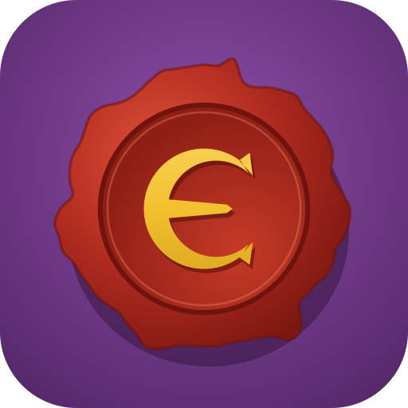

  

<h1 align="center">Escriba de la Marca</h1>

  Tu biblioteca de <em>Aventuras en la Marca del Este</em>, siempre en el bolsillo. 
  <strong><a href="https://favashi.github.io/escribadelamarca/">Abrir la app →</a></strong>

---

¿Estás en una tienda o en unas jornadas, con un módulo en la mano, y no recuerdas si ya lo tienes?
Escanea el código de barras y **Escriba de la Marca** te dice al momento si está en tu colección y desde cuándo.

## Qué puedes hacer

- **Toda tu colección, ordenada.** Más de 100 publicaciones de la Marca del Este catalogadas por serie y categoría
  (módulos B, X, C, Gazetteer, Xorandor…), con el recuento de lo que tienes y lo que te falta.
- **Escanear y listo.** Con la cámara del móvil: si ya lo tienes, te dice la fecha en que lo registraste; si no, lo añades con un toque.
  Para los módulos antiguos sin código de barras, basta con escribir el código de la portada (B1, X2, G0…).
- **En todos tus dispositivos.** Entras con tu cuenta de Google y tu biblioteca se sincroniza entre móvil y ordenador.
  Se puede instalar en la pantalla de inicio como una app más.
- **Catálogo de la comunidad.** ¿Falta un libro, o un código de barras no lo reconoce? Proponlo desde la app y, tras revisarlo, lo tendrán todos.

## Gratis, con extras para Mecenas

La app es gratuita. Si te resulta útil, puedes invitarme a un café en
**[Buy Me a Coffee](https://buymeacoffee.com/toniruiz)**. Con una aportación de 3 € o más te conviertes en **Mecenas**
y desbloqueas: lista de deseos, registro de préstamos, estadísticas de tu colección, exportación a CSV/JSON y el tema Pergamino.

## De dónde salen los datos

El catálogo se ha elaborado a partir de fuentes públicas:
[Distribuciones Sombra](https://dbsombra.com/index.asp?cod=12LM),
[Tesoros de la Marca](https://tesorosdelamarca.com/) y
[Codex LMDE](https://github.com/diacritica/codexlmde).
Algunos datos pueden tener errores (sobre todo los códigos de barras, que se van verificando con ejemplares reales).
Si ves algo mal, propón la corrección desde la app o abre un [issue](https://github.com/Favashi/escribadelamarca/issues).

## Más proyectos

¿Diriges partidas OSR? Prueba también **[OSR Manager](https://favashi.github.io/osr-manager/)**, una ayuda de mesa
para directores de juego (turnos, luz, encuentros, viaje por hexes…).

## Para desarrolladores

HTML y JavaScript sin build, [Supabase](https://supabase.com) como backend y GitHub Pages para publicar.
Cómo está montado, cómo desplegar tu propia instancia y cómo mantener el catálogo:
**[docs/DESARROLLO.md](docs/DESARROLLO.md)**.

## Licencia y avisos

- Código bajo **[GNU AGPL-3.0](LICENSE)**: puedes usarlo, modificarlo y publicarlo, pero si ofreces una versión
  modificada debes compartir su código bajo la misma licencia.
- **Proyecto de fans, no oficial.** *Aventuras en la Marca del Este*, sus títulos, logotipos e ilustraciones pertenecen
  a sus respectivos autores y no se incluyen en este repositorio.
- [Política de privacidad](https://favashi.github.io/escribadelamarca/privacidad.html).

Copyright (C) 2026 Favashi
